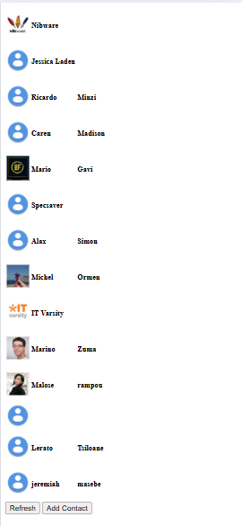
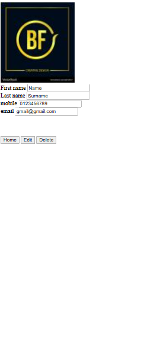

# 📒 Contact Book Webpage

A responsive contact management web app built with **HTML**, **CSS**, and **JavaScript**, using the **iT Varsity API**. Users can **view**, **create**, and **edit** contacts through a clean and simple interface.

## 🔍 Overview

This project connects to the iT Varsity API to:
- Display a list of existing contacts
- Allow users to add new contacts
- Enable editing of existing contact details

All data is handled dynamically via JavaScript and stored/retrieved through the API.

## ✨ Features

- ✅ View all contacts (name, phone, email)
- ➕ Create new contacts
- ✏️ Edit existing contacts
- 🔄 Real-time updates using the iT Varsity API
- 📱 Mobile-friendly layout

## 🔌 Powered By

- [iT Varsity API](https://itvarsity.org)

## 🛠️ Tech Stack

- **HTML5** – Page structure
- **CSS3** – Layout and styling
- **JavaScript (Vanilla)** – API integration and form handling

## 📸 Preview

  
  

